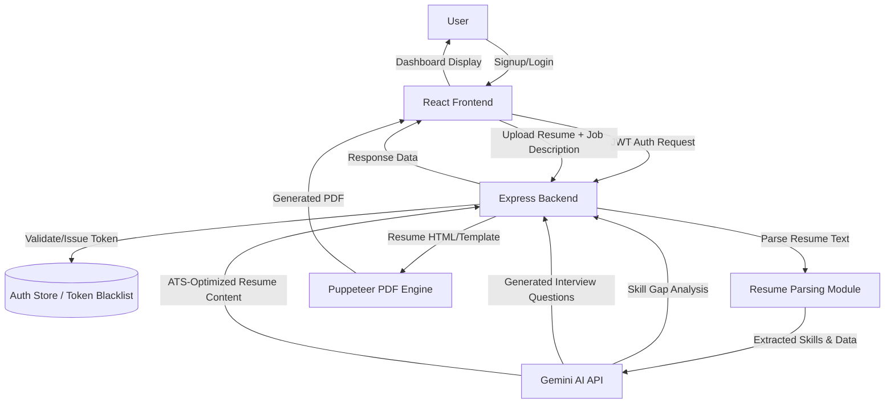

# 🤖 Gen AI Job Preparation Platform

A production-ready full stack Gen AI application that helps users prepare for job interviews — upload a resume, analyze it against a job description, detect skill gaps, generate AI-powered interview questions, and download an ATS-optimized resume as a PDF.

---

## 📖 Table of Contents

- [Overview](#-overview)
- [Features](#-features)
- [Tech Stack](#-tech-stack)
- [System Architecture](#-system-architecture)
- [Workflow](#-workflow)
- [Authentication & Token Blacklisting](#-authentication--token-blacklisting)
- [AI Integration](#-ai-integration)
- [API Endpoints](#-api-endpoints)
- [Project Structure](#-project-structure)
- [Installation & Setup](#-installation--setup)
- [Environment Variables](#-environment-variables)
- [Future Scope](#-future-scope)
- [Author](#-author)

---

## 📌 Overview

This platform simulates a real-world Gen AI product where a user can:
1. Sign up/log in securely
2. Upload their resume
3. Paste a target job description
4. Get an AI-driven skill gap analysis
5. Receive tailored interview questions
6. Generate and download an ATS-optimized resume as a PDF

---

## 🚀 Features

| Feature | Description |
|---|---|
| 🔐 Secure Authentication | JWT-based login/signup with token blacklisting on logout |
| 📄 Resume Parsing | Extracts text and structured data (skills, experience) from uploaded resumes |
| 🧠 Skill Gap Detection | Gemini AI compares resume skills against the job description |
| ❓ AI Interview Questions | Generates role-specific technical & behavioral questions |
| 📑 ATS Resume Generation | Produces an ATS-friendly, keyword-optimized resume |
| 🖨️ Dynamic PDF Export | Puppeteer renders the generated resume as a downloadable PDF |

---

## 🛠️ Tech Stack

| Layer | Technology |
|---|---|
| Frontend | React.js |
| Backend | Node.js, Express.js |
| Authentication | JWT + Token Blacklisting |
| AI Engine | Gemini API |
| PDF Generation | Puppeteer |
| API Testing | Postman |

---

## 🏗️ System Architecture



---

## 🔄 Workflow

| Step | Action |
|---|---|
| 1 | User registers/logs in; backend issues a JWT on successful authentication |
| 2 | User uploads their resume and pastes the target job description |
| 3 | Backend parses the resume to extract text, skills, and experience |
| 4 | Extracted resume data + job description are sent to Gemini API |
| 5 | Gemini returns a structured skill gap analysis (matched vs. missing skills) |
| 6 | User requests interview prep; Gemini generates tailored technical/behavioral questions |
| 7 | User requests an optimized resume; Gemini rewrites content to be ATS-friendly |
| 8 | Puppeteer converts the generated resume content into a styled, downloadable PDF |
| 9 | On logout, the JWT is added to a blacklist so it can no longer be reused |

---

## 🔐 Authentication & Token Blacklisting

| Concept | How it Works |
|---|---|
| **JWT Issuance** | On login, server signs a JWT containing the user ID and expiry, sent to the client |
| **Protected Routes** | Middleware verifies the JWT on every protected request before granting access |
| **Logout Handling** | Since JWTs can't be "deleted" once issued, the token is added to a **blacklist** store on logout |
| **Blacklist Check** | Middleware checks incoming tokens against the blacklist before validating them — blacklisted tokens are rejected even if not yet expired |
| **Why it matters** | Prevents a stolen/old token from being reused after a user has explicitly logged out |

---

## 🤖 AI Integration

The backend sends structured prompts to Gemini for three distinct tasks:

| Task | Input to Gemini | Output |
|---|---|---|
| Skill Gap Detection | Resume skills + job description | List of matched skills, missing skills, and suggestions |
| Interview Question Generation | Job role + detected skill gaps | Technical and behavioral questions relevant to the role |
| ATS Resume Optimization | Original resume content + job description keywords | Rewritten, keyword-aligned resume content in a structured format |

**Safeguards:**
- Prompts enforce a structured JSON response format for reliable parsing
- Backend validates AI output before using it to generate the PDF or displaying it to the user

---

## 🔌 API Endpoints

| Method | Endpoint | Description | Access |
|---|---|---|---|
| `POST` | `/api/auth/register` | Register a new user 
| `POST` | `/api/auth/login` | Authenticate user and issue JWT (stored in cookie) 
| `GET` | `/api/auth/logout` | Clear JWT from cookie and add the token to the blacklist
| `GET` | `/api/auth/get-me` | Get details of the currently logged-in user 
| `POST` | `/api/interview/` | Upload resume (PDF) along with self description and job description to generate an AI interview report (technical and behavioral questions, skill gaps) 
| `GET` | `/api/interview/` | Get all interview reports of the logged-in user 
| `GET` | `/api/interview/report/:interviewId` | Get a specific interview report by ID 
| `POST` | `/api/interview/resume/pdf/:interviewReportId` | Generate an ATS-optimized resume and download it as a PDF via Puppeteer

---

## 📁 Project Structure

```
genai-job-prep/
├── backend/
│   ├── models/              # User, Resume, Analysis schemas
│   ├── routes/               # Auth, resume, AI, PDF routes
│   ├── controllers/          # Business logic per feature
│   ├── middleware/
│   │   ├── auth.js           # JWT verification
│   │   └── blacklist.js      # Token blacklist check
│   ├── utils/
│   │   ├── geminiClient.js   # Gemini API wrapper
│   │   ├── resumeParser.js   # Resume text/skill extraction
│   │   └── pdfGenerator.js   # Puppeteer PDF logic
│   ├── .env
│   └── server.js
├── frontend/
│   ├── src/
│   │   ├── components/       # Reusable UI components
│   │   ├── pages/            # Login, Dashboard, Resume Upload, Results
│   │   └── App.js
│   └── package.json
└── README.md
```

---

## ⚙️ Installation & Setup

```bash
# Clone the repository
git clone https://github.com/<username>/genai-job-prep.git
cd genai-job-prep

# Install backend dependencies
cd backend
npm install

# Install frontend dependencies
cd ../frontend
npm install

# Start backend server
cd ../backend
npm run dev

# Start frontend
cd ../frontend
npm start
```

---

## 🔐 Environment Variables

Create a `.env` file inside the `backend` folder:

| Variable | Description |
|---|---|
| `JWT_SECRET` | Secret key used to sign JWT tokens |
| `GEMINI_API_KEY` | API key for Gemini AI integration |
| `PORT` | Backend server port |
| `MONGO_URI` / `DB_URI` | Database connection string (if persistence is used) |

---

## 🚀 Future Scope

- **Multi-Format Export:** Download resumes in DOCX in addition to PDF
- **AI Voice Interview:** Practice mock interviews through real-time voice conversation with AI
- **Job Recommendations:** Suggest relevant jobs based on the user's resume and skills
- **Resume Builder:** Create a resume from scratch with a guided form and live preview

---

## 👨‍💻 Author

**Adarsh Gupta**
